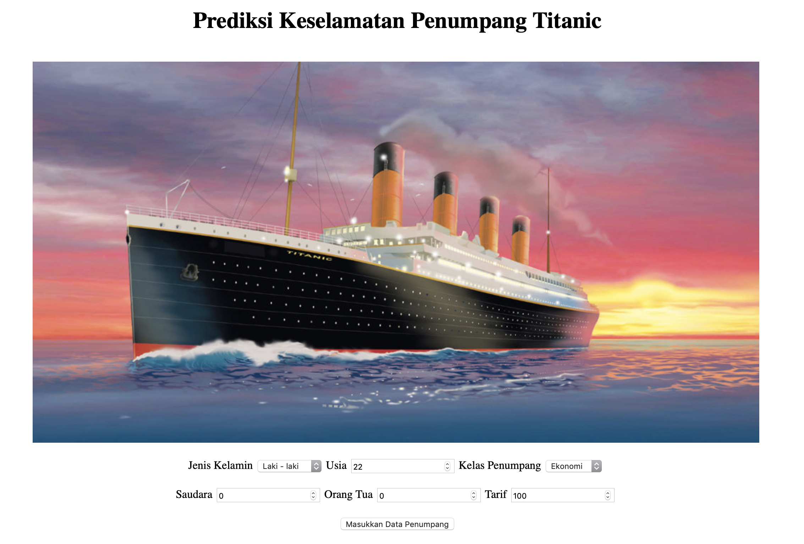
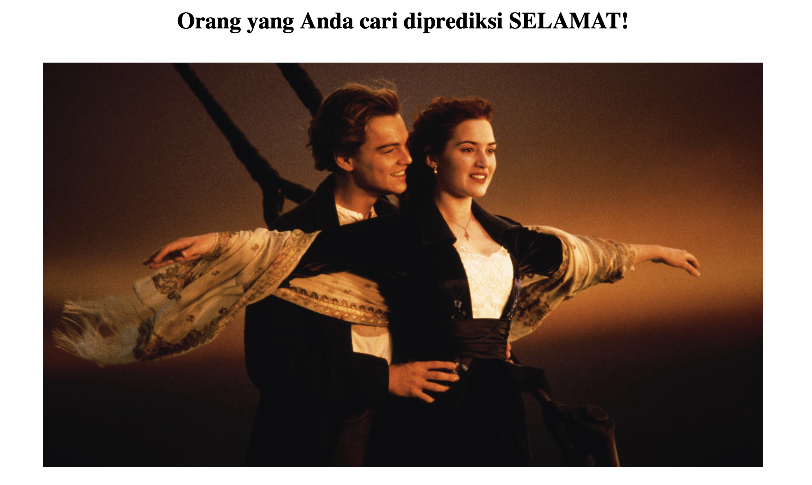
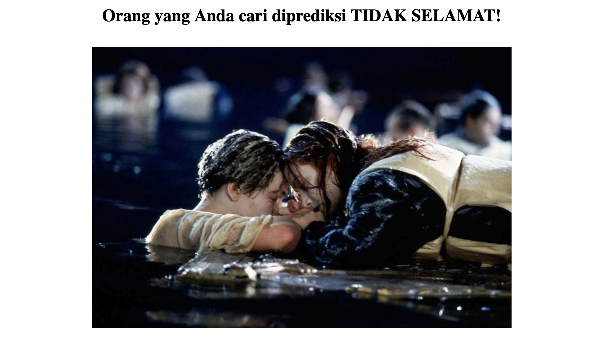

# DUMMY APP OF TITANIC PASSENGER SURVIVAL

#

Using __Logistic Regression__ method to predict the passenger survival in Titanic accident.

At the home page you are supposed to give input of one passenger through several criterias:

Then, the machine will predict whether that passenger is managed to be saved or dead.

- If the passenger is saved will show:

- Else the passenger is predicted to be dead and will show:

#
#### About Me: Suryo Tri Atmojo 👨‍🔬👨‍💻
#### Reach me out 📬 : _atmojo.suryo@gmail.com_

[GitHub](https://github.com/suryotriatmojo)
|
[Instagram](https://www.instagram.com/suryotriatmojo/)
|
[Facebook](https://www.facebook.com/suryo.t.atmojo)
|
[LinkedIn](https://www.linkedin.com/in/suryo-tri-atmojo-3ab69a85/)
|
[Twitter](https://twitter.com/suryota)